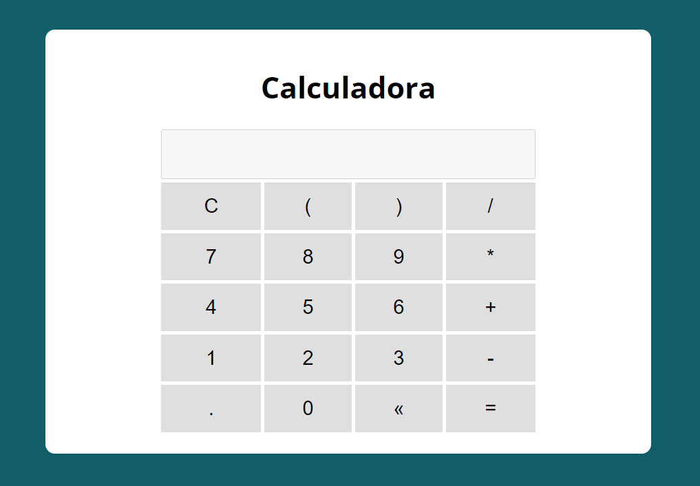

# 🖩 Calculadora 
---
### Funcionalidades

* Todas as funcionalidades de uma calculadora comum

> Com esta calculadora võce poderé fazer contas de adição, multiplicação, divisão, subtração, etc...

:link: - Live Site URL: [https://thiago87dev.github.io/calculadora/](https://thiago87dev.github.io/calculadora/)

---

### 🛠️ Construído com

* HTML5
* CSS3
* JavaScript ES6

---

### :camera: Screenshot 

## ✒️ Autor

- Linkedin - [Thiago Alves](https://www.linkedin.com/in/thiago-alves-010915274/)
- GitHub - [Thiago87dev](https://github.com/Thiago87dev)
- Frontend Mentor - [@MrThiago87](https://www.frontendmentor.io/profile/MrThiago87)
- Instagram - [@thiagopaulista87](https://www.instagram.com/thiagopaulista87/)
